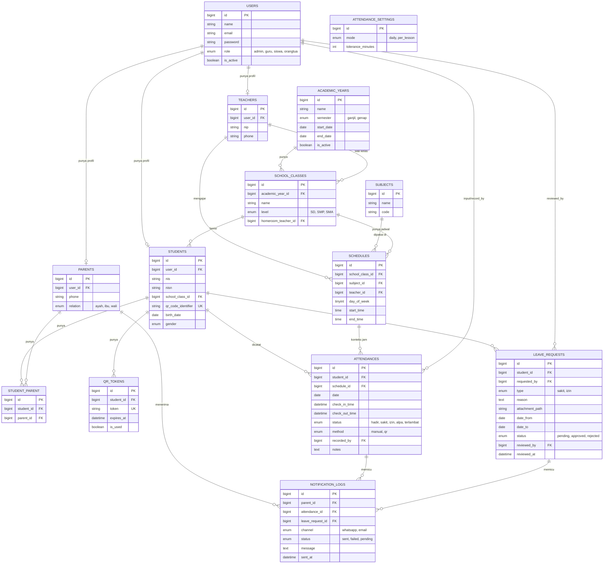

# ERD — Database Aplikasi Absensi Siswa

## Catatan Desain

- **users** memakai kolom `role` sederhana (enum) untuk versi awal. Jika kebutuhan hak akses makin kompleks (misal: kepala sekolah, guru piket, guru BK), pertimbangkan migrasi ke package `spatie/laravel-permission` di fase 2.
- **students.qr_code_identifier** adalah ID unik permanen siswa (dicetak di kartu). **qr_tokens** terpisah, berisi token yang **berubah/expired** — ini yang benar-benar dipindai tiap hari agar QR tidak bisa difoto lalu dipakai titip absen oleh orang lain.
- **attendances.schedule_id** bersifat nullable: diisi jika mode absensi "per_lesson" (SMP/SMA), dikosongkan jika mode "daily" (SD/MI, satu baris absensi per hari per siswa).
- **attendance_settings** didesain sebagai tabel 1 baris (school-wide config) karena single-tenant. Jika nanti multi-tenant, tabel ini butuh kolom `school_id`.
- Semua tabel relasi (teachers, students, parents) memisahkan **profil** dari **users** agar tabel `users` tetap ringan dan fokus ke autentikasi.
